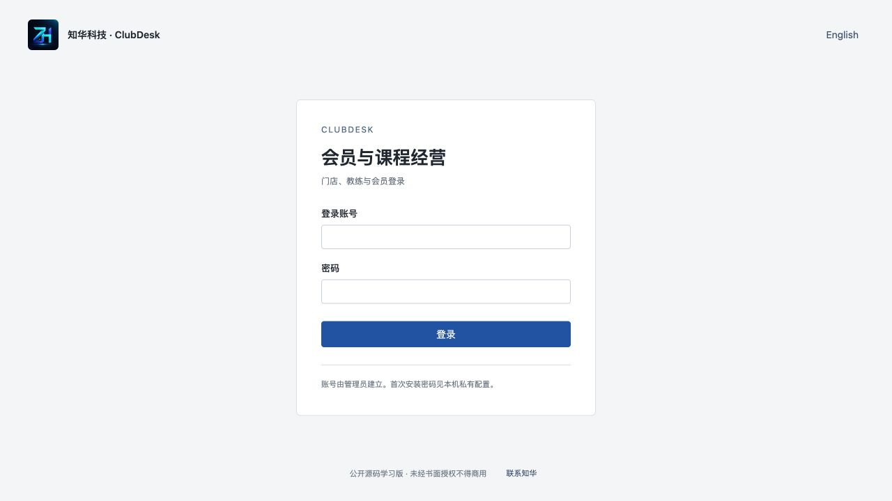
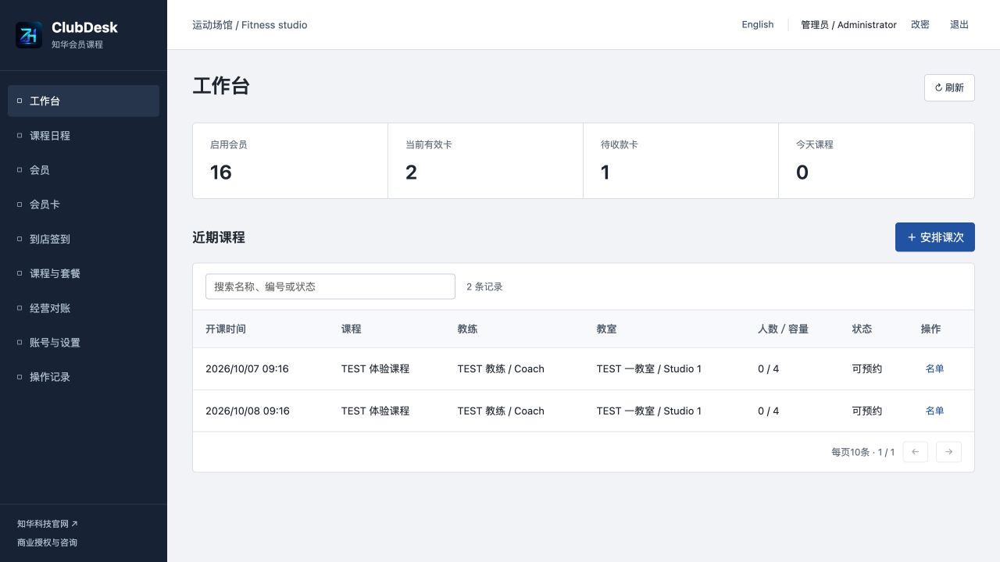
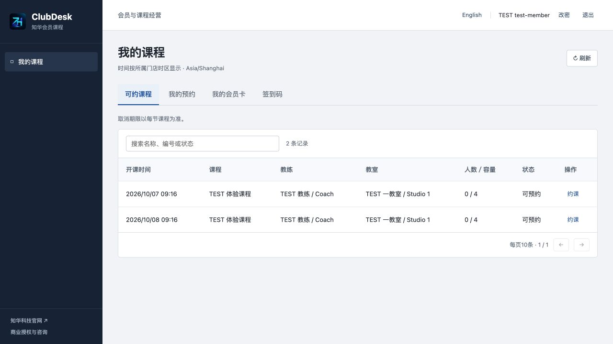
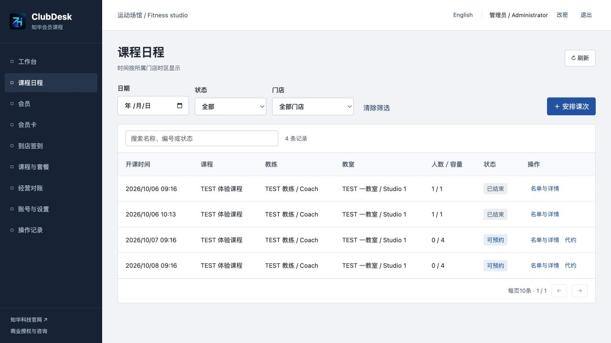
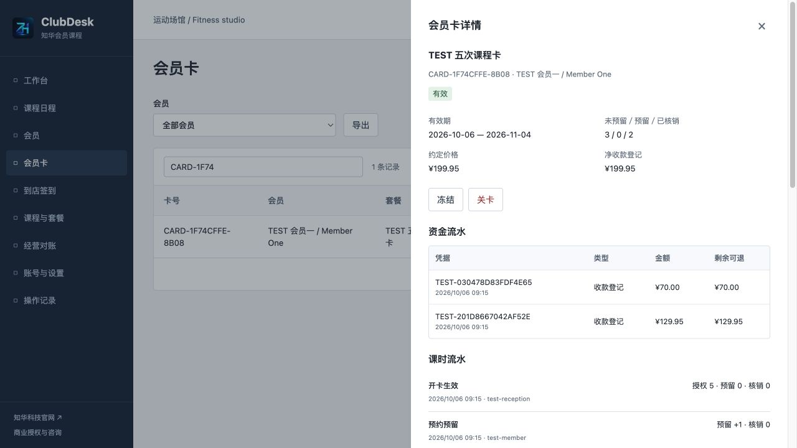
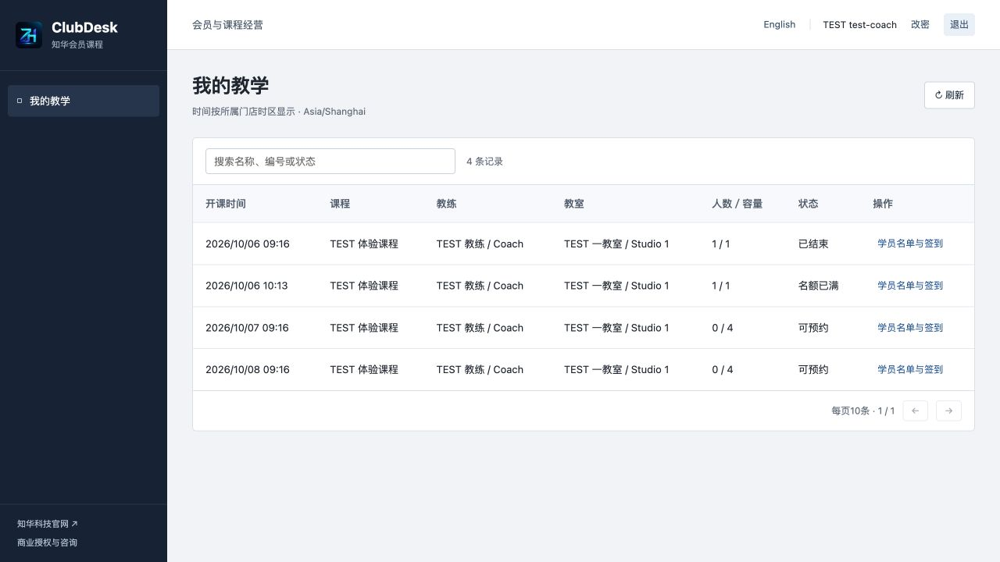
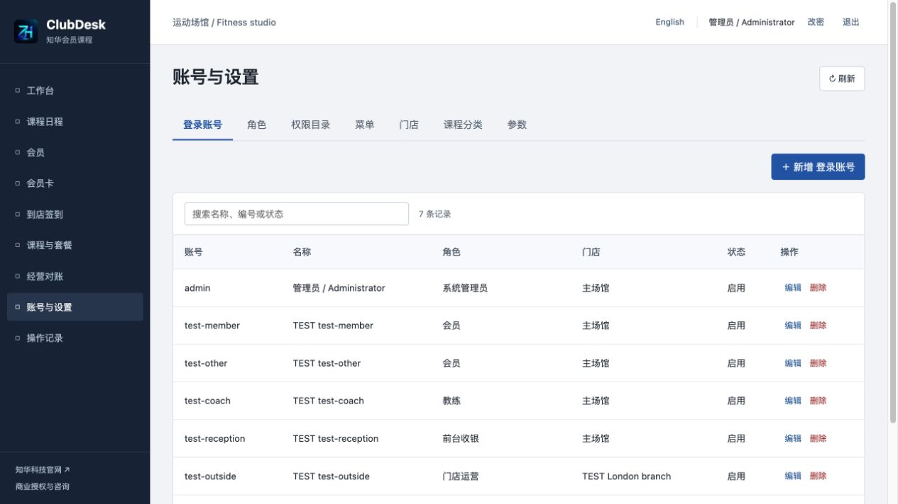
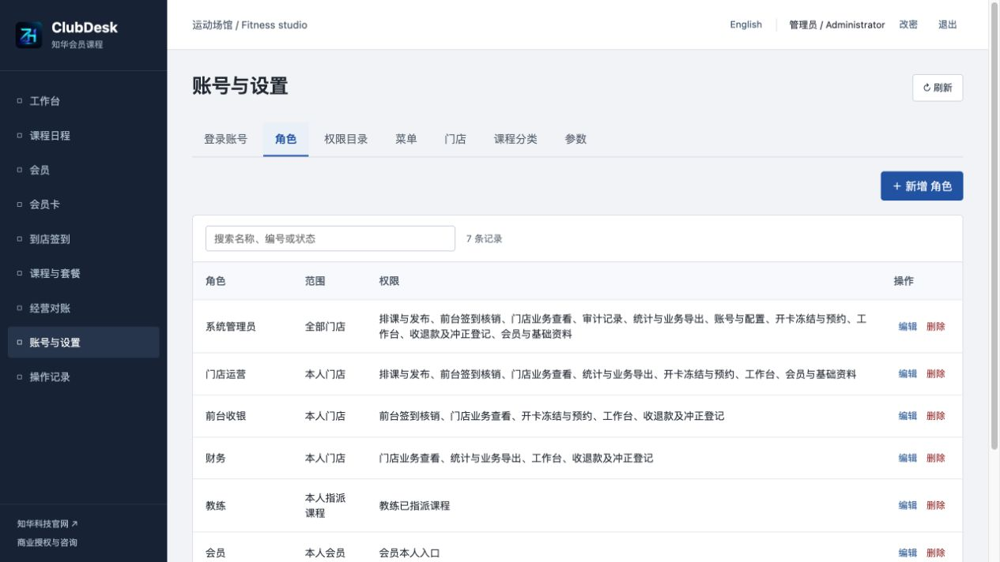
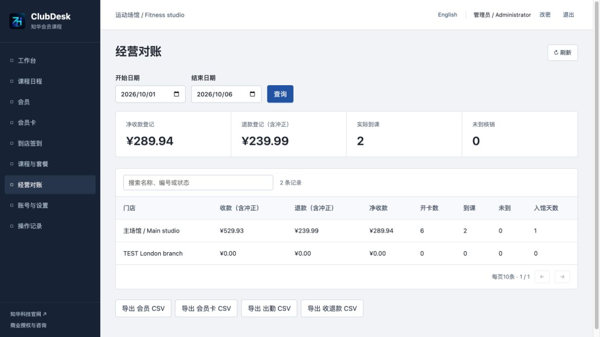
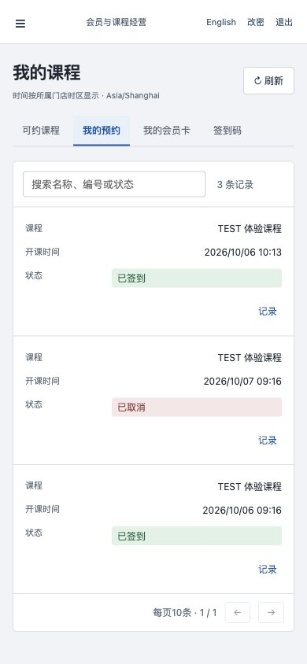

[中文](README.md) | [English](README.en.md)

<p></p>

# ClubDesk · 知华会员与课程经营

**1.0.0 · 公开源码学习版／非商业源码版。未经书面授权不得商用。**

知华科技（上海如静知华信息科技有限公司） · [官网](https://www.zhuatech.cn/) · 商业咨询微信 **zhuatech / zhuatech2**。

适合独立健身房、瑜伽及普拉提工作室，以及为场馆交付软件的实施团队。ClubDesk 将会员卡约定、实际收款登记、课程名额、预约预留、现场签到、课时核销和退费记录放进同一条可核对流程。中文 / English，电脑与手机使用同一套真实后端，独立私有部署。

[操作手册](docs/manual.md) · [English guide](docs/english-guide.md) · [部署与恢复](docs/deployment.md) · [API](docs/api.md)

## 一张卡如何真正用起来

1. 建立门店、会员、教练、教室、课程项目及套餐；为会员和教练分别建立绑定本人档案的登录账号。
2. 开卡保存套餐价格、次数、有效期和币种快照。卡先处于待收款状态，分次登记已核实的外部收款；足额收款才生效。以后改套餐不会改旧卡。
3. 排课时核对教室容量、教练和教室时间冲突，先保存草稿再发布。会员手机选择课程与自己的可用卡；一个会员不能重复或重叠约课。
4. 预约先占一个名额并预留一次课时。现场核验到课后，预留才转换为已核销；重复签到或并发抢最后一个名额不会重复扣课时。
5. 会员按课次的提前取消期限自行取消，返回预留。工作人员处理例外须留原因。课后核对未到人员，按约定核销一次；录错则新增纠错流水，不能抹除原核销。
6. 冻结卡时核对冻结期内预约并延期；提前解冻扣回未使用的延期，不能让已有预约失效。续开建立新卡，不覆盖旧卡。关卡取消其未完成预约，退费另按实际外部退款、原收款可退余额登记。

**期限卡**在有效期内支持不限课次预约和场馆到店登记；**次卡**每节课使用一次，不代表不限次入馆。套餐仅适用于所属门店，不提供储值钱包或跨店通用卡。

## 三个真实入口

- **门店员工：** 会员与档案、开卡、分次收款、排课发布、代约、签到、冻结解冻、关卡退款、对账导出及审计。按钮和接口分别检查权限。
- **教练：** 本人被指派的已发布课程和学员名单，核验到课或未到；不读取会员联系方式、卡价格、资金记录或其他教练名单。
- **会员：** 本人卡、收退款及课时记录、所属门店课程、预约与取消、动态签到码和本人到店历史；不能读取其他会员档案。

一个实例服务一个经营主体，可以建立多个门店。管理员可跨门店，普通员工属于一个门店；教练与会员档案固定所属门店。不是跨公司多租户SaaS，也不是任意连锁权益共享系统。

## 当前运行页面

图片来自当前版本实际运行页面，使用明确标记的TEST验收资料；空库安装不会生成这些会员、交易或课程。

| 登录 | 工作台 |
|---|---|
|  |  |

| 会员手机业务 | 课程日程 |
|---|---|
|  |  |

| 会员卡与台账 | 教练课程 |
|---|---|
|  |  |

| 后台账号 | 角色与权限 |
|---|---|
|  |  |

| 经营对账 | 手机约课 |
|---|---|
|  |  |

登录页提供账号登录及语言切换；工作台展示当前权限范围内的会员、卡和课次。会员入口查看本人卡与预约；课程日程管理草稿、发布及名额。会员卡详情展示约定、收退款和课时流水；教练入口只展示本人指派课程。账号页管理岗位与档案绑定，角色页管理权限及资料范围。经营对账核对各门店收款净额与出勤；手机页面完成会员约课及签到码操作。

## 已实现能力与边界

| 模块 | 实际功能 |
|---|---|
| 会员及目录 | 会员、教练、教室、课程项目、次卡/期限卡套餐的新增编辑、启停、版本、引用保护、搜索排序与分页；会员CSV整批导入、逐记录预览和失败回滚 |
| 卡与资金 | 待收款开卡、冻结约定快照、足额收款生效、分次收款、原收款退款、单次冲正、不可修改的资金历史、币种锁定、冻结延期/提前解冻、续开及关卡 |
| 排课 | 门店本地时间、IANA时区、教练和教室冲突、容量、草稿/发布/撤回/取消/结束、课次取消时限快照 |
| 预约与出勤 | 本人/代约、一个课次一条会员预约、课时预留/释放/使用/纠错流水、时间冲突和超额保护、单次二维码、手工签到、未到核销、期限卡每日一次到店 |
| 管理 | 账号、角色、权限名称、菜单名称/顺序/启停、门店与时区、课程分类、参数；会员和教练身份绑定不可转换，最后管理员保护 |
| 通用 | BCrypt12轮、HttpOnly会话、CSRF、强密码、改密和旧会话失效、实时接口权限、资料范围、操作历史与审计、中文/英文、手机、仪表盘、门店日期对账与CSV |

以下是明确边界：

- 收款、退款和冲正是**人工登记已经核实的外部事实**，不转账、不扣银行卡、不核验支付回调，也不生成税务发票。软件记录不证明实际到账。
- 动态码两分钟、单次使用。支持键盘式扫码枪输入、二维码图片本地识别及浏览器摄像头读取；摄像头需要HTTPS或本机安全来源与设备授权。工作人员仍须核对现场身份。没有门禁开锁、指纹、人脸、离线签到、位置校验或远程防代签承诺。
- 没有在线支付、自动订阅扣款、短信邮件、WhatsApp、电子签约、财务总账、教练工资提成、课时权重、跨店通用卡、公开注册或原生App。硬件SDK和支付适配须另行开发并实测。
- 一个预约核销一次课时；课次容量1可用于私教。无候补队列、批量周期排课、多人共享卡、跨时区重复课规则或自动恢复课次。
- 列表按当前权限取回后在客户端搜索排序、每页10条；单类读取最多10000条，不宣称海量服务器分页。实例写入通过基础门店锁串行化，面向小型场馆，非高并发分布式SaaS。

## 安装自己的空库实例

环境：Docker与Compose v2；分别开发需Java **21**、Maven **3.9**、Node **24.19.0+**、MySQL **8.4**。后端Spring Boot **4.0.7** / Security / JPA / Flyway，前端Vue **3.5.40** / Vite **8.1.5**；MySQL Connector/J **9.7.0**连接MySQL 8.4，JDBC协议为`jdbc:mysql://`。

```bash
python3 scripts/init-env.py
# 随机密码仅在本机私有.env；端口被占用时修改WEB_PORT
# 不停止其他项目或删除其数据库卷
docker compose config --quiet
docker compose up -d --build --wait
```

打开 [http://localhost:8124/](http://localhost:8124/)，健康检查 [http://localhost:8124/actuator/health](http://localhost:8124/actuator/health)。初始账号默认`admin`，密码是私有`.env`中的`ADMIN_PASSWORD`，**没有公共演示密码**。初始化脚本生成三份独立强密码，权限0600，拒绝覆盖已有文件；重启不重置密码或业务。

首次空库只创建一个主门店、6种角色、12个权限、11个菜单、4个课程分类和3个参数及管理员；**不创建会员、教练、教室、套餐、会员卡、预约或资金记录**。

| 配置 | 用途 |
|---|---|
| `MYSQL_ROOT_PASSWORD` | 唯一强数据库管理口令 |
| `DATABASE_PASSWORD` | 独立数据库应用口令 |
| `ADMIN_USERNAME / ADMIN_PASSWORD` | 初始管理员；密码12–72字节含大小写字母和数字 |
| `WEB_PORT / BIND_ADDRESS` | 默认8124 / 127.0.0.1；支持覆盖 |
| `COOKIE_SECURE` | 本机HTTP false；正式HTTPS true |
| `DATABASE_URL / DATABASE_USER` | 可选外部MySQL；正式连接配置证书校验与可信CA |

手机访问须有手机能访问的门店部署地址；手机的`localhost`不是电脑。正式入口使用可信HTTPS，见[部署说明](docs/deployment.md)。核心业务不需要模型、第三方密钥、短信或云账号；摄像头许可只用于本机扫描，二维码图片不上传服务器。

分别开发：先启动MySQL，安全注入`DATABASE_URL`、`DATABASE_USER`、`DATABASE_PASSWORD`及管理员环境变量，运行`mvn -f backend/pom.xml spring-boot:run`；前端`cd frontend && npm ci --no-audit --no-fund && npm run dev`，Vite默认5173同源代理8080。前端生产Nginx通过容器服务名转发`/api`，不写死后端主机。

## 数据、升级与验证

```text
backend/src/main/java/cn/zhuatech/clubdesk/   权限、卡、排课、课时、资金和范围
backend/src/main/resources/db/migration/    Flyway版本化完整建表
backend/src/test/                           业务规则与HTTP/JPA回归
frontend/src/                              前台、会员、教练、管理及真实扫码
scripts/                                  凭证初始化、空库验收、发布扫描
frontend/public/brand/ + docs/images/       正式LOGO及两原微信二维码
docs/                                     操作、接口、架构、部署、安全与测试
compose.yaml                              独立MySQL、Java、Vue Nginx
```

22张应用表及Flyway历史表，见[V1](backend/src/main/resources/db/migration/V1__club_schema.sql)。资金使用BigDecimal和数据库两位小数，拒绝额外精度和整数截断；卡约定、课次约定、业务历史、资金流水和课时流水真实持久化。写入在READ_COMMITTED事务中串行校验，外键、唯一约束、余额及状态规则共同保护历史。

升级前备份并在独立新卷恢复，验证账号、角色、课次、余额及原始流水，再增加V2迁移；不得改写已执行的V1。JPA只验证结构，不代替迁移。详见[架构与数据库](docs/architecture.md)、[备份与恢复](docs/deployment.md#备份与恢复)。

```bash
mvn -B -f backend/pom.xml spotless:check test package
cd frontend
npm ci --no-audit --no-fund
npm run format:check
npm run lint
npm test
npm run build
cd ..
docker compose config --quiet
docker compose build
python3 scripts/release-check.py
git diff --check
```

后端33项规则及HTTP/JPA回归，前端16项回归；H2不能替代真实MySQL。Docker Maven不跳过测试。只对新建、可丢弃的全新测试实例运行`TEST_URL=http://127.0.0.1:8124 python3 scripts/smoke-test.py`，该脚本主动拒绝非空业务库，并只生成TEST资料。测试范围和硬件验证限制见[测试说明](docs/testing.md)。

常见情况：

- 卡不能预约：核对收款是否足额、整节课是否被有效期覆盖、冻结区间、未预留课时与所属门店。
- 课程不可约：核对发布状态、开课时间、剩余名额和会员时间冲突。草稿不能预约，修改已有预约的课程须先处理预约。
- 冻结被拒绝：先取消冻结期间预约；提前解冻缩短延期后不能使未来预约过期。
- 二维码无效：核对两分钟期限、刷新和单次使用；选错课次不会扣课时，换正确课次再核对。扫码成功也不代表门禁已开锁。
- 资金改错：按真实外部冲正新增记录；生效卡先关卡，原收款有退款时先处理退款依赖，不覆盖旧记录。
- 导入或版本冲突：整批导入失败没有部分保存；按记录编号修正后重新预览。版本过期先刷新核对，不自动重发写入。
- 启动失败：核对口令、端口及三容器健康，看本实例日志，不能删其他项目数据解决。

## 安全、反馈与联系知华科技

使用可信HTTPS、强密码、最小岗位权限、受限网络及定期备份恢复演练。账号密码散列不进入接口返回；短期签到明文只在本人生成响应出现，数据库只保存散列。登录失败有单实例五分钟限制，未实现SSO、MFA或跨节点限流。门店时区在建立卡或课次后锁定，币种在建立套餐或卡后锁定。详见[安全说明](docs/security.md)。

贡献请附业务复现、验证及小范围差异，保留署名与许可；Issues只放脱敏步骤和环境，不提交客户资料、密码、会话或数据库。漏洞请通过官网或微信私下反馈。软件按现状提供，部署方须独立验收自身经营规则、退款约定、第三方服务与安全要求；不作到账、税务、硬件或合规保证。

自有源码限个人学习、技术研究和非商业交流，以[LICENSE](LICENSE)为准，不是OSI标准开源许可证。Vue、Lucide、QRCode和ZXing等第三方按各自原许可保留，见[第三方声明](docs/third-party.md)；品牌文案不改变第三方许可。

本项目由知华科技（上海如静知华信息科技有限公司）提供公开源码学习版本，主要用于个人学习、技术研究与非商业交流。未经书面授权不得商用。企业信息化建设、中小企业数字化转型、中小企业 AI 转型、私有化部署、软件外包、软件项目外包、软件实施、FDE 外包、OPC 技术支持及深度定制开发，请访问[知华科技官网](https://www.zhuatech.cn/)，或添加微信 zhuatech、zhuatech2 咨询。

服务范围：商业源码授权、私有部署、会员资料迁移、品牌适配、门禁/支付接口适配、业务规则定制及系统集成。企业使用、为客户交付、二次销售和SaaS经营须取得对应书面授权，不默认转让源码版权。

**商业授权或深度定制开发请联系知华科技。**

<table><tr><td align="center"><br>微信：zhuatech</td><td align="center"><br>微信：zhuatech2</td></tr></table>
